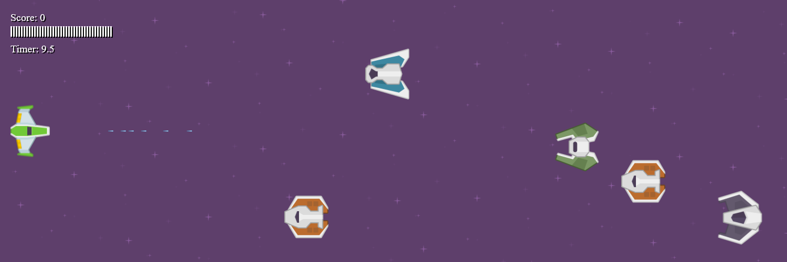
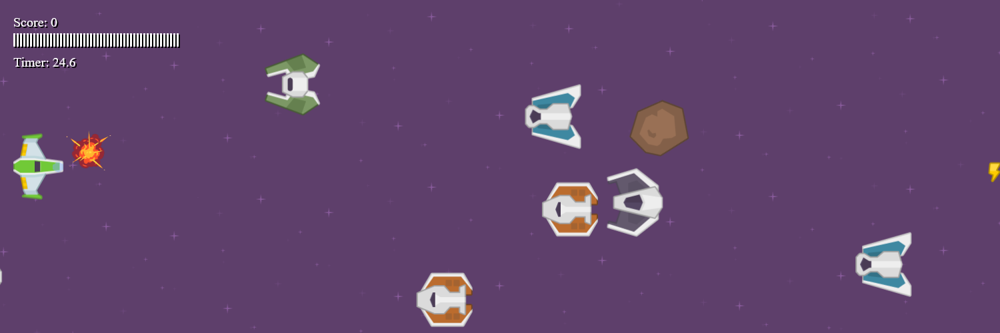

# Space Shooter

Space Shooter is an exhilarating space-themed game developed using HTML, CSS, and JavaScript. Take command of your spaceship as you navigate the boundless cosmos and engage in intense battles against alien forces. Immerse yourself in a heart-pounding gaming experience with stunning visuals and endless interstellar challenges in the exciting world of Space Shooter.

## Features

- Intense space battles with alien enemies.
- Smooth and responsive spaceship controls.
- Eye-catching graphics and visual effects.
- Endless gameplay for hours of fun.
- Developed using HTML, CSS, and JavaScript.

## How to Play

1. Clone this repository to your local machine.
2. Open the `index.html` file in your web browser.
3. Use the **up arrow** key to move your spaceship up.
4. Use the **down arrow** key to move your spaceship down.
5. Press **M** to toggle sound (mute/unmute).
6. Press the **space bar** to shoot lasers at alien enemies.
7. Press **D** to enable development mode.

Survive as long as possible, shoot down alien enemies, and achieve the highest score in Space Shooter!

## Screenshots

